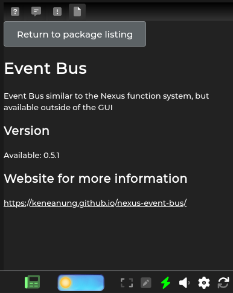
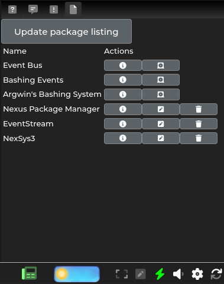

# v0.2.0 Dependencies

I'm happy to announce that the project reached a huge milestone. It now handles dependencies of packages that are [listed in package repository](https://keneanung.github.io/nexus-package-repository/).

## Handling dependencies

Whenever the package manager installs a package, it checks, whether it has other packages that are required for it to function correctly. These packages are first searched in the local package list. If they are installed, the package manager proceeds to install the original package as normal. If a dependency is not installed, the package manager will first install the dependency, before proceeding with the actual requested package installation.

The package manager will also make sure, that dependencies are listed in the correct order. This makes sure that the initialization of a package is only attempted when all dependencies are already initialized. No more documenting "and make sure package A is above package B". This happens both after the installation and update of a package.

## UI improvements

The UI also got some improvements. You can now show package details within the window, including version, description, dependencies and a link to the website.

The UI main page got some layout imprvements by using icons instead of text for buttons, which makes the page much cleaner.

## Closing words

If these features got you interested, please feel free to either [open an issue about including your package](https://github.com/keneanung/nexus-package-repository/issues/new?assignees=&labels=new+package&template=new_package.yml&title=%5BPackage%5D%3A+) in the package listing or contact me on the Achaea or Nexus discrod if you need more information. You can also send me a direct message.

If you like the project, please consider leaving a star on the [GitHub project](https://github.com/keneanung/nexus-package-manager) and [sponsoring me](https://github.com/sponsors/keneanung).